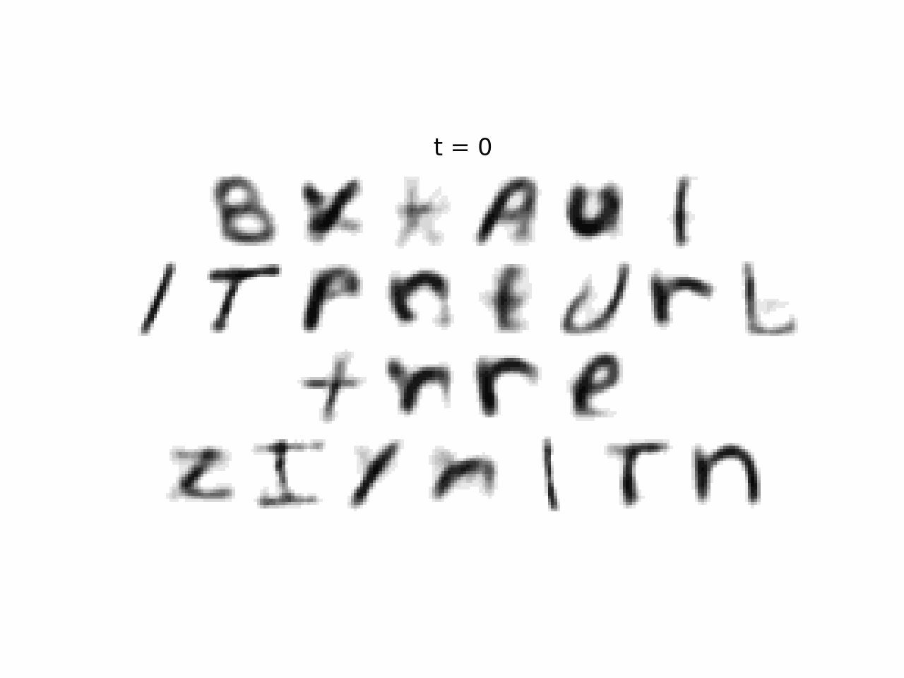

# Neural Networks from Scratch

This repo hosts custom implementations of **Numpy-only** neural network architectures. Implemented and planned architectures include: 
- ✓ An artificial neural network (ANN)
    - ✓ Regularization (written as weight decay)
    - ✓ Isolate weight update and optimizer from gradient calculating process
    - ✓ [ADAM optimizer](https://arxiv.org/pdf/1412.6980)
    - Regularization term for loss obj
    - GPU-ify with [CuPy](https://cupy.dev/)
    - Dropout
    - Automatic differentiation
- ✓ Autoencoder
- ✓ Variational autoencoder
- ✓ Latent Denoising diffusion model
    - Classifier free guidance
- Convolutional neural network (CNN)
- Transformer
    - Sentence-embedding model
    - Text-to-image model

## Datasets used for Benchmarking
Datasets used in this projects include:
- [MNIST](https://www.tensorflow.org/datasets/catalog/mnist)
- [Iris](https://archive.ics.uci.edu/dataset/53/iris)
- [Half Moon](https://scikit-learn.org/stable/modules/generated/sklearn.datasets.make_moons.html)

## Best Results Achieved
*Summarization table in progress*
| Model Type | Arch | Regularization | Dropout | Epoch| Lr | Dataset | Acc |
|-|-|-|-|-|-|-|-|
| ANN | (784,) | L2 | 0 | 0 | 0 | MNIST | 0 |
| ANN | (4,) | L2 | 0 | 0 | 0 | Iris | 0 |

* Performance for training a (784, 30, 10) ANN for 100 epochs is 0.3232 minutes on CPU only. 

## Resources
*Citations in progress*
- [Introduction to Deep Learning](http://neuralnetworksanddeeplearning.com/) by Michael Nielsen
